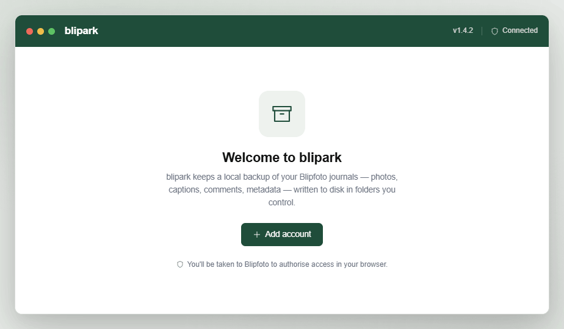
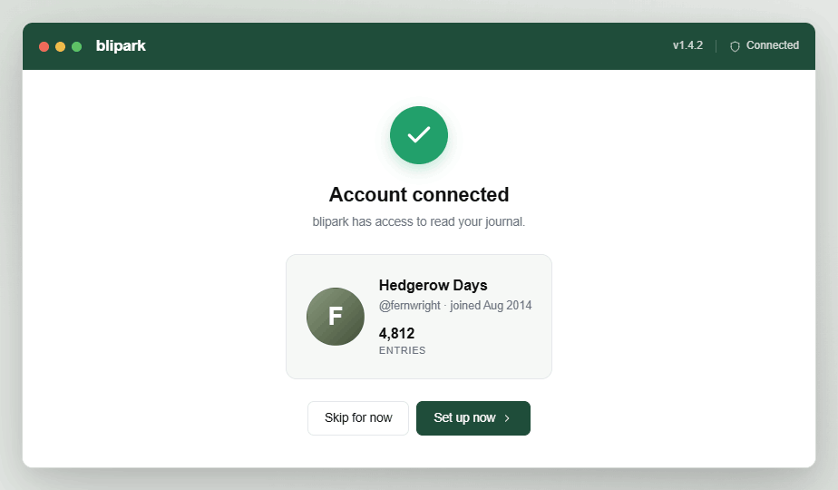
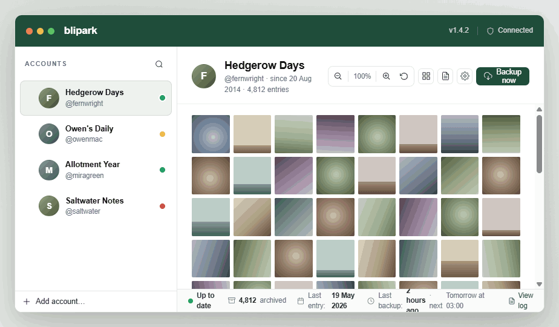
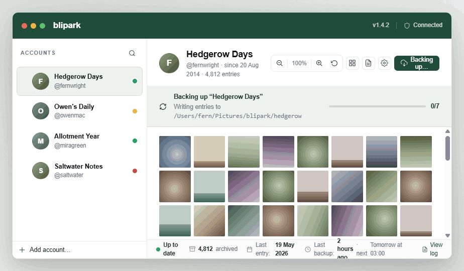
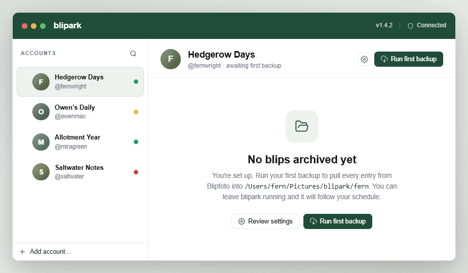
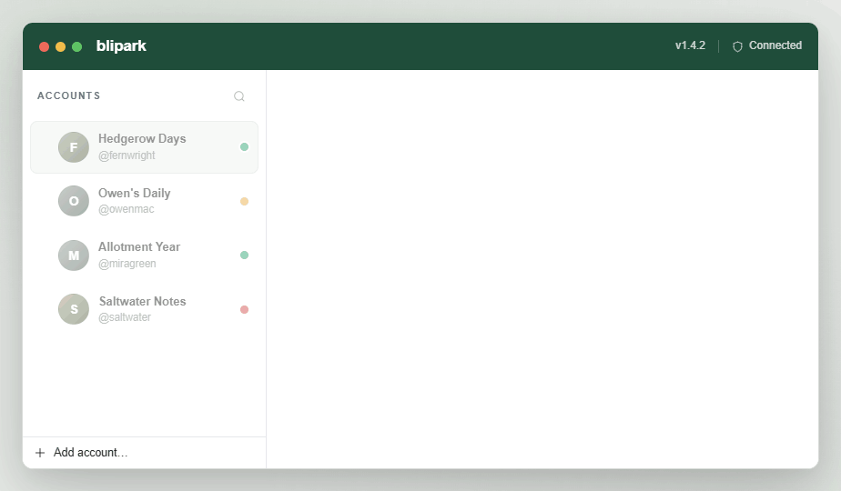

# Handoff: blipark desktop app

## Overview

**blipark** is a cross-platform desktop app that creates local backups of one or more Blipfoto journals. It connects to a user's Blipfoto account via OAuth and runs scheduled functions that pull entries (photos + captions + comments + metadata) onto disk in folders the user controls.

This handoff bundles a complete high-fidelity, click-through prototype of the app's UI so a developer (using Claude Code or otherwise) can reproduce it in a real codebase.

## About the design files

The files in this bundle are **design references created in HTML/React**. They are interactive prototypes — they show the intended look, layout, and basic navigation, but they are **not production code to ship**. They use no real backend, no Blipfoto API integration, no real OAuth, no real filesystem, and no real scheduler.

Your task is to **recreate this design in the target codebase's environment**, using that codebase's established libraries and patterns. The likely target here is a cross-platform desktop framework (Electron, Tauri, Wails, .NET MAUI, etc.) — choose whichever matches the existing project, or pick the most appropriate one if starting fresh. The HTML/CSS shown here is just a faithful mock; ignore the implementation details (Babel + inline JSX, the placeholder gradient thumbnails, etc.) and lift only the visual design and interaction model.

## Fidelity

**High-fidelity.** Pixel-level decisions are intentional. Colors, spacing, typography, border radii, and component proportions are final. Recreate them faithfully using the target codebase's component library where one exists.

What is *not* part of the design and must be replaced in implementation:
- Photo thumbnails are deterministic gradient placeholders. In the real app these are square thumbnails of the user's blip images.
- Account avatars are coloured initial badges; the real app will use the user's Blipfoto profile photo.
- The "Prototype screens" chip strip just below the top bar is a navigation aid for the prototype only. **Do not implement it.** Screen transitions in the real app are driven by user actions (clicking sidebar accounts, clicking toolbar icons, etc.).

---

## App shell

The app is a single window:

```
┌──────────────────────────────────────────────────────────────────────┐
│ Top bar  (52px tall, dark green)                                     │
├────────────┬─────────────────────────────────────────────────────────┤
│            │                                                         │
│  Sidebar   │  Main area                                              │
│  (268px)   │  (fills remaining width)                                │
│            │                                                         │
│            │                                                         │
│            │                                                         │
│            ├─────────────────────────────────────────────────────────┤
│            │  Status bar (38px tall, only on home screen)            │
└────────────┴─────────────────────────────────────────────────────────┘
```

- **Top bar** is always present.
- **Sidebar** is always present after the first OAuth pairing is complete.
- **Main area** swaps between several screens (Home, Settings, Log, Empty, etc.).
- When the **Settings** or **Log** screen is shown, it takes over the entire main area and the sidebar account rows are visually disabled and not clickable.

The window has rounded corners (12px) and a soft drop shadow when shown on a desktop. The traffic-light dots in the top-left of the top bar are decorative — the real implementation should defer to the host OS's native window chrome.

---

## Design tokens

### Colours

| Token | Hex | Use |
|---|---|---|
| `--green-900` | `#143729` | Darkest green, used for strong text emphasis on tinted backgrounds |
| `--green-800` | `#1f4d3a` | **Primary green.** Top bar background, primary button background, accent icons, focus ring base |
| `--green-700` | `#2a6347` | Primary button hover |
| `--green-100` | `#eef2ee` | Soft tint for selected sidebar account row, primary-button-on-light hover, banner background |
| `--green-50`  | `#f6f8f6` | Hover tint for ghost buttons and account rows |
| `--ink`       | `#111111` | Primary text |
| `--ink-2`     | `#2a2a2a` | Slightly softer primary text |
| `--muted`     | `#6b7280` | Secondary text, labels |
| `--muted-2`   | `#9ca3af` | Tertiary text, disabled icons |
| `--line`      | `#e5e7eb` | Borders, dividers |
| `--line-2`    | `#eeeeee` | Soft inner dividers |
| `--bg`        | `#ffffff` | App background |
| `--bg-alt`    | `#fafafa` | Status bar background `#fafbfa` |
| `--rag-green` | `#22a06b` | RAG: up-to-date |
| `--rag-amber` | `#e8a93c` | RAG: catching up |
| `--rag-red`   | `#d04545` | RAG: needs attention |
| `--blue-info` | `#2f6fd1` | Info log icon |

### Typography

- **Family:** `"Helvetica Neue", Helvetica, Arial, sans-serif`
- Body / default: `13px` / line-height `1.45`
- Captions / labels: `11.5px – 12px`, `var(--muted)`
- Account journal name: `13px / 600 weight`
- Account @handle: `11.5px / 400 / var(--muted)`
- Section heading in main toolbar (`h1`): `18px / 600 / letter-spacing -0.01em`
- Empty-state / OAuth-success heading: `22px / 600 / letter-spacing -0.015em`
- Settings setting name: `13px / 600`
- Setting description: `12px / var(--muted) / line-height 1.5`
- Monospace (file paths, log timestamps, log messages, date input): `ui-monospace, "SF Mono", Menlo, monospace`, `11.5–12px`
- Top bar wordmark: `17px / 700 / letter-spacing -0.01em / white`

### Spacing & shape

- Border radius: `6px` (inputs / icon buttons), `7px` (buttons), `8px` (sidebar rows, toolbar groups), `10–12px` (cards), `2px` (thumbnails — almost-square).
- Window radius: `12px` outer
- Heights: top bar `52px`, status bar `38px`, main header padding `18px 24px 14px`, sidebar account row padding `10px 10px`
- Sidebar width: `268px`
- Right-panel content (settings) max-width: `760px`, centred
- Input height: `32px`. Button height: `30px` (regular) / `38px` (lg). Icon button: `26×26` (sidebar) or `28×28` (toolbar group).

### Shadows

- Soft card: `0 1px 2px rgba(15,23,32,0.04), 0 8px 24px rgba(15,23,32,0.06)`
- Window: `0 30px 80px rgba(0,0,0,0.18), 0 8px 24px rgba(0,0,0,0.08)`
- Primary button on success badge: `0 6px 18px rgba(34,160,107,0.28)`

### Icons

Hairline, Lucide-style: `viewBox 24×24`, stroke width `1.6`, rounded caps/joins, `currentColor`. The full icon set used is in `icons.jsx`. Use a real icon library (Lucide React, Phosphor, etc.) in the implementation — do not hand-roll SVGs.

---

## Screens

Every screen below has a corresponding PNG in `screenshots/` for visual reference.

| # | Screen | File |
|---|---|---|
| 1 | First Open / Add Account | `screenshots/01-first-open.png` |
| 2 | OAuth Success | `screenshots/02-oauth-success.png` |
| 3 | Home (default state) | `screenshots/03-home.png` |
| 4 | Empty account | `screenshots/04-empty-account.png` |
| 5 | Backup in progress | `screenshots/05-backup-running.png` |
| 6 | Settings (full main area) | `screenshots/06-settings.png` |
| 7 | Log (full main area) | `screenshots/07-log.png` |

### 1. First Open / Add Account




**Trigger:** App opened with zero accounts configured.

**Layout:** Top bar + main area only (no sidebar, no status bar). Centred card.

**Content:**
- Icon badge (64×64, `--green-100` background, `--green-800` archive icon, 16px radius)
- Heading: "Welcome to blipark"
- Body: "blipark keeps a local backup of your Blipfoto journals — photos, captions, comments, metadata — written to disk in folders you control."
- Primary button (lg): "+ Add account"
- Footer hint with shield icon: "You'll be taken to Blipfoto to authorise access in your browser."

**Behavior:** Clicking *Add account* opens the system browser at the Blipfoto OAuth URL, then waits for the OAuth redirect/callback. On success, the app transitions to the **OAuth success** screen.

### 2. OAuth Success



**Trigger:** Successful return from Blipfoto OAuth.

**Layout:** Top bar + main area only. Centred card.

**Content:**
- Green check badge (64×64 circle, `--rag-green`, white check, soft shadow)
- Heading: "Account connected"
- Lead: "blipark has access to read your journal."
- **Profile card** (full-width inside the centred column, `--green-50` background, 12px radius, 22px padding):
  - 64×64 avatar (real profile photo)
  - Journal name (16px / 600)
  - "@handle · joined Mmm YYYY" (12.5px / muted)
  - One stat block: Entries count (16px / 600 number + 11px uppercase label)
- Footer buttons (right-aligned within card width):
  - Secondary (lg): "Skip for now"
  - Primary (lg): "Set up now ›"

**Behavior:**
- *Skip for now* → Home screen with the new account selected and shown in the Empty state.
- *Set up now* → Home screen with the new account selected, **and immediately opens the Settings screen** in the main area.

### 3. Home Screen



**Trigger:** Default state when at least one account exists.

#### Sidebar

- Header row: small uppercase "Accounts" label, search icon button on the right.
- Account rows, one per configured account:
  - Grip handle (6 dots) on the left, **shown on hover only**. Dragging a row reorders the list. Order is persisted.
  - 34×34 round avatar (real profile photo)
  - Journal name (13px / 600) on top, `@user` (11.5px / muted) underneath
  - RAG dot (9×9, 2px white outline) on the right
- Selected row: `--green-100` background, faint green border.
- The selected row's green RAG dot has a subtle pulse animation (only when state = green and selected).
- Footer of sidebar: full-width text button "+ Add account…" → opens the OAuth flow again.

RAG semantics:
- **Green** — fully set up, last scheduled backup completed on time.
- **Amber** — fully set up but not up-to-date (machine off, initial backup not finished, etc.).
- **Red** — last backup failed or required setup info is missing.

#### Main area header

- Avatar (40×40) of the selected account.
- Title block: Journal name (18px / 600), then sub-line: `@user · since DD Mmm YYYY · N entries`.
- Right side toolbar, in this exact order:
  - **Thumbnail size group** (rounded box, white background, 1px line border, 2px internal padding):
    - Zoom-out icon button → decreases thumbnail size by 10%
    - Current percentage label (e.g. `100%`), tabular numerals
    - Zoom-in icon button → increases by 10%
    - Reset icon button → returns to 100%
  - Single icon button: View (grid layout) — placeholder, no behavior yet.
  - Single icon button: Logs (file-text icon) — opens Log screen.
  - Single icon button: Settings (gear) — opens Settings screen.
  - Primary button: "Backup now" with cloud-download icon. Becomes disabled and reads "Backing up…" while a backup is in progress.

#### Thumbnail grid

- Bare gallery: square thumbnails (`aspect-ratio: 1/1`) in a CSS grid with `6px` gap.
- `grid-template-columns: repeat(<cols>, minmax(0, 1fr))`.
- **Column count is derived from the thumbnail-size percentage** so that thumbnails never get cropped at the right edge. The reference formula used in the prototype:
  ```
  cols = clamp(4, 14, round(8 * (100 / sizePercent)))
  ```
  At 100% → 8 columns. Higher % → fewer, larger columns. Lower % → more, smaller columns.
- Grid is the only thing in the scroll region: `flex: 1; overflow-y: auto; padding: 18px 24px;`.
- Hover state: a faint dark gradient on the bottom of each tile (`opacity 0 → 1`, 140ms).

#### Status bar (bottom)

Single horizontal row, `--muted` 11.5px text, with these stats separated by 18px gaps:

- RAG status: coloured dot + bold label ("Up to date", "Catching up", or "Needs attention")
- Archive icon + bold archived count
- Calendar icon + "Last entry: **DD Mmm YYYY**"
- Clock icon + "Last backup: **<relative>** · next <scheduled>"
- Spacer pushes the next items to the right.
- If the account has an error: red alert icon + brief red error message (e.g. "API token expired — reauthorise account").
- Always: green text link "View log" (file-text icon) → opens Log screen.

#### Behavior

- Clicking a sidebar row selects that account; main area updates immediately.
- Reordering sidebar rows is via drag.
- Backup-now button starts a backup and transitions to the Backup-in-progress state (still the home screen, with banner overlay).

### 4. Backup in progress (home variant)



**Trigger:** User clicks *Backup now*.

A horizontal banner appears **between the main header and the thumbnail grid**:

- Background `--green-100`, 12px 24px padding, 1px bottom border `rgba(31,77,58,0.12)`.
- Spinning refresh icon (`--green-800`).
- Two-line text block:
  - Title: `Backing up "<journal name>"` (`--green-900`, 600)
  - Sub: `Writing entries to <folder path>` (muted, mono font for the path)
- Right side: 220px-wide progress bar (4px tall, 99px radius, `--green-800` fill on `rgba(31,77,58,0.14)` track), plus an X/Y entry count (tabular numerals, `--green-900` 600).

The "Backup now" button in the toolbar becomes disabled and reads "Backing up…".

When the backup completes the banner disappears and the toolbar button returns to normal.

### 5. Empty account state



**Trigger:** A newly-added account is selected but has zero entries archived yet.

- Same main header (avatar + journal name + sub-line, but sub reads "@user · awaiting first backup").
- Toolbar: just Settings icon and the primary "Run first backup" button (cloud-download icon).
- Body: centred card identical in structure to First Open, but:
  - Icon badge: open-folder icon
  - Heading: "No blips archived yet"
  - Body: "You're set up. Run your first backup to pull every entry from Blipfoto into `<folder>`. You can leave blipark running and it will follow your schedule."
  - Two buttons side by side: "Review settings" (secondary) and "Run first backup" (primary).
- Status bar: amber RAG + "Awaiting first backup", archived count "0", folder path.

### 6. Settings screen


**Trigger:** Toolbar settings icon, OAuth success "Set up now" button, or Empty state "Review settings" button.

**Layout:** Replaces the entire main area (header, grid, status bar — all gone). Sidebar account rows become visually disabled (45% opacity, no hover, not clickable). Body content is centred to a `max-width: 760px` column.

#### Header bar of the settings screen

`16px 20px` padding, 1px bottom border.

- Left: settings gear icon (`--green-800`) + heading "Settings · <Journal name>"
- Right: close × icon button → returns to Home screen.

#### Settings (in order)

Each setting is a block with `18px 20px` padding, bottom 1px divider, and a label row at the top showing the setting name (13px / 600) and a small hint text on the right.

1. **Folder**
   - Hint: "Where backups are written"
   - Single row: mono-font text input (flex, takes most width) joined to a *Choose…* button with an open-folder icon. The two visually merge: the input has right corners squared off and the button has left corners squared off.
   - Clicking *Choose…* invokes the OS folder picker.

2. **Schedule**
   - Hint: "Next run will follow this"
   - Description: "blipark will check for new entries at this time, and then again every interval."
   - Three inline rows. Each row has a small uppercase 38px-wide left label, then a control filling the rest.
     - **Date** — mono text input (`YYYY-MM-DD`) joined to a calendar-icon button that opens a date picker.
     - **Time** — `<select>` dropdown with options `00:00`, `01:00`, …, `23:00`.
     - **Every** — `<select>` dropdown: `Daily | Weekly | Monthly`.

3. **Gap check**
   - Hint: "Days to look back"
   - Description: "On each run, look back this many days and fill in any missing entries."
   - 80px-wide right-aligned number input + literal "days" label. Default `31`.

4. **Redo**
   - Hint: "Most-recent entries to refresh"
   - Description: "Re-download this many of the latest entries each run, in case captions or comments have changed since the last backup."
   - 80px number input + "entries" label. Default `7`.

5. **Account**
   - Two secondary buttons side by side:
     - *Reauthorise* (refresh icon)
     - *Remove account* (trash icon, text in `--rag-red`)

All controls have visible focus rings: 1px `--green-700` border + 3px `rgba(31,77,58,0.12)` outer ring.

The settings block is designed to scroll; future settings can be appended below.

### 7. Log screen



**Trigger:** Toolbar log icon, or "View log" link in the status bar.

**Layout:** Replaces the entire main area; sidebar disabled (same rules as Settings).

#### Header bar

Same chrome as Settings header: file-text icon + "Log · <Journal name>", and a close × on the right.

#### Toolbar row

`10px 20px` padding, 1px bottom border, 12px muted text.

- "Filter" label.
- Segmented control: `All | Errors | Warnings | Success | Info`. Each non-"All" button has a 10×10 coloured dot to its left matching that level. Active filter: `--green-100` background, `--green-800` text.
- Right-aligned: "N of M" count (tabular numerals).

#### Log table

Each row is a CSS grid with three columns: `22px | 92px | 1fr`, gap 10px, 6px vertical padding, 20px horizontal padding, very faint 1px bottom divider.

- **Icon cell** (column 1): a 16×16 round badge in the level colour with a white glyph inside.
  - Error: red × (stroke 3)
  - Warning: amber triangle (`!`)
  - Success: green check (stroke 3)
  - Info: blue circle with white `i`
- **Timestamp** (column 2): mono `HH:MM:SS`, muted colour.
- **Message** (column 3): mono, ink colour, line-height 1.55.

Row-level background tints:
- Error rows: `#fdf6f5`
- Warning rows: `#fffaf0`
- Info / Success: plain white.

The body scrolls. Sample log entries are in `screens.jsx` (`LOG_ENTRIES`) and illustrate the tone — short, factual, with timestamps and quoted entry titles.

---

## Interactions & behavior

- **Navigation between Home / Settings / Log / Backup is local state.** No URL routing required for an Electron-style desktop app.
- **Right-panel takeover animation:** when entering Settings or Log, the main area animates in:
  ```css
  @keyframes panelIn {
    from { opacity: 0; transform: translateY(6px); }
    to   { opacity: 1; transform: none; }
  }
  ```
  220ms, `cubic-bezier(0.22, 0.61, 0.36, 1)`.
- **Backup banner progress** in the prototype animates toward ~94% asymptotically over ~7s. Replace with real progress events (entries processed / total).
- **Drag-to-reorder** in the sidebar should persist account order locally.
- **All hover states** use the green tint family — never blue or grey. Icon buttons go `transparent → --green-100`, with their colour shifting from `--ink-2` to `--green-800`.
- **Disabled state** (used on sidebar rows while Settings or Log is open): 45% opacity, pointer-events: none.

---

## State (what an implementation will need)

- List of `Account` records (id, journal name, @handle, profile photo URL, folder, schedule {date, hour, interval}, gapCheckDays, redoCount, lastSyncAt, nextRunAt, totalBlips, sinceDate, RAG state, optional error message). Persist locally.
- Currently-selected account ID.
- Thumbnail size (percentage). Persist per-account or globally.
- Right-panel mode: `null | "settings" | "log"`.
- Backup-running flag per account, with progress (entriesDone, entriesTotal).
- Log buffer per account.

The Blipfoto API client, OAuth flow, scheduler, and on-disk archive writer are all out of scope for the visual handoff — implement to match Blipfoto's published API.

---

## Files in this bundle

- `blipark.html` — entry point; loads React + Babel and the JSX modules below.
- `styles.css` — all visual styling. **Source of truth for tokens and component appearance.**
- `app.jsx` — top-level component, screen routing, prototype screen-switcher chips (omit in the real app).
- `screens.jsx` — every screen and sub-component: `TopBar`, `Sidebar`, `HomeScreen`, `FirstOpenScreen`, `OAuthSuccessScreen`, `EmptyAccountScreen`, `SettingsPanel`, `LogPanel`. Also mock data (`ACCOUNTS`, `LOG_ENTRIES`).
- `icons.jsx` — hairline SVG icons used throughout. Replace with a real icon library in the implementation.
- `placeholders.jsx` — gradient-tile photo and avatar placeholders. **Replace with real images.**

Open `blipark.html` in any modern browser to interact with the prototype. The chip strip just below the top bar lets you jump between every screen state.
