# Information architecture

This is the map of the app: the primary navigation, and the complete inventory of **screens**
(`SCR-NN`) and **flows** (`FLW-NN`) with their priority.

Tag legend is in the [README](README.md#conventions). Screens are grouped by behaviour, so one
screen here may cover several distinct surfaces — the five browse feeds are one tabbed Browse
screen, and all settings sections live on one Settings screen.

The ID sequences have deliberate gaps: **SCR-26, SCR-27, SCR-28 and FLW-19 are unused.** They are
retired IDs, not omissions, and are never reallocated.

---

## Navigation map

```mermaid
flowchart TD
    subgraph Primary["Primary navigation (logged in)"]
        NEW[New Entry]
        BR[SCR-02 Browse]
        SR[SCR-03 Search]
        MP[SCR-04 Map]
        MYP[SCR-17 My Profile]
        SET[SCR-25 Settings]
        HLP[SCR-29 Help & Info]
        NOTE[SCR-23 Notifications]
        MYC[SCR-24 Comments]
    end

    SI[SCR-01 Sign In]
    ENT[SCR-06 Entry Detail]

    NEW --> SCR09[SCR-09 New Entry: pick photo]
    SCR09 --> SCR10[SCR-10 Compose Details]
    SCR10 --> SCR11[SCR-11 Description Editor]
    SCR10 --> SCR12[SCR-12 Location Picker]
    SCR10 --> SCR14[SCR-14 Upload Progress]

    BR --> ENT
    SR --> ENT
    SR --> PROF[SCR-18 User Profile]
    MP --> ENT
    NOTE --> ENT
    NOTE --> PROF
    MYC --> ENT

    ENT --> SCR07[SCR-07 Full-screen Photo]
    ENT --> SCR08[SCR-08 Entry Metadata]
    ENT --> SCR05[SCR-05 Tag Entries]
    ENT --> PROF
    ENT --> SCR15[SCR-15 New Comment]
    ENT --> SCR16[SCR-16 Report Entry]
    ENT --> SCR13[SCR-13 Edit Entry]
    ENT --> SCR31
    PROF --> SCR31

    MYP --> SCR19[SCR-19 Followers / Following]
    MYP --> SCR20[SCR-20 Pending Requests]
    MYP --> SCR22[SCR-22 Awards]
    PROF --> SCR19
    PROF --> SCR22

    SET --> SCR31[SCR-31 Hidden Members]
    SET --> SCR21[SCR-21 Refused Followers]
    SET --> SCR30[SCR-30 Accounts]
    HLP --> ICON[Icon Guide / Legal]

    ENT -. "any gated action" .-> SI
    SI -. "resume" .-> ENT
    SCR05 --> ENT
    MP -.-> ENT
```

Notes:
- **Logged-out** primary navigation is reduced: Browse (Recent/Popular/Nearby only), Search, Map,
  public Profiles and Entries, Help & Info, and a Sign In entry point. Account-requiring actions
  trigger the sign-in flow (`FLW-01`).
- **Entry Detail (`SCR-06`)** is the content hub, reachable from every feed, search, tag, map,
  notification, deep link, and profile.
- **Deep links** for entries (web URL and custom scheme) and **share-to-Blipfoto** land users
  directly on the relevant screen/flow — see [rules.md](rules.md).
- **Account switcher** — whenever two or more accounts are stored, a small avatar in this
  navigation chrome is always present and opens a quick switcher (`FLW-21`), so a screen reached
  cold (deep link, push) doesn't leave the active account ambiguous. See [rules.md](rules.md)
  (Multi-account clarity).

---

## Screen inventory

| ID | Screen | Priority | Summary |
|---|---|---|---|
| SCR-01 | Sign In | [Must] | OAuth sign-in; entry point for every gated action, and where the sign-in mode is chosen. A "register" affordance opens Blipfoto registration in the browser (no in-app registration). |
| SCR-02 | Browse | [Must] | Tabbed feeds: Recent, Following, Just Me, Popular, Nearby (logged-out: Recent, Popular, Nearby). Pull-to-refresh + pagination. |
| SCR-03 | Search | [Must] | Two tabs: Entries (text) and People; debounced query. |
| SCR-04 | Map | [Should] | Geotagged entries on a map; pan/zoom loads entries in view. |
| SCR-05 | Tag Entries | [Should] | Grid of entries for a given tag. |
| SCR-06 | Entry Detail | [Must] | The content hub: photo, title, stats, description, tags, comments + replies, actions; prev/next within a journal. |
| SCR-07 | Full-screen Photo | [Must] | Full-screen image viewer with pinch-zoom and pan. |
| SCR-08 | Entry Metadata | [Should] | Read-only EXIF/camera metadata for an entry. |
| SCR-09 | New Entry (pick photo) | [Must] | Take or choose a photo to start a new entry. |
| SCR-10 | Compose Entry Details | [Must] | Title, tags, description, date (publish-eligibility check), location, optional crop; triggers upload. |
| SCR-11 | Description Editor | [Should] | Rich-text editor for entry/bio/comment descriptions. **BBCode**, with formatting **toolbar buttons** for the supported tags (mirroring the website), so users rarely type raw BBCode. |
| SCR-12 | Location Picker | [Should] | Place/clear a geotag on a map for compose/edit. |
| SCR-13 | Edit Entry | [Must] | Family: edit details, replace photo; delete entry. |
| SCR-14 | Upload Progress | [Should] | Status of the durable upload queue (could be folded into notifications + in-feed state). |
| SCR-15 | New Comment / Reply | [Must] | Compose a comment or threaded reply. |
| SCR-16 | Report Entry | [Must] | Report an entry (reason checkboxes + optional note). |
| SCR-17 | My Profile | [Must] | Own profile: About, Entries, Favourites, Followers, Following, Awards. |
| SCR-18 | User Profile | [Must] | Another member's profile + follow/unfollow. |
| SCR-19 | Followers / Following | [Must] | Paged user lists (from profile tabs). |
| SCR-20 | Pending Requests | [Must] | Approve/refuse follow requests (protected journals). Refusing removes their access to the journal. |
| SCR-21 | Refused Followers | [Must] | Members whose follow request was refused, and restoring their access. **They can't see you.** |
| SCR-22 | Awards | [Should] | Earned badges; icon guide. |
| SCR-23 | Notifications Inbox | [Must] | Recent notifications with unread count; delivery via the cloud notification service. |
| SCR-24 | Comments Inbox | [Must] | Recent comments received, with unread count and reply affordance. |
| SCR-25 | Settings | [Must] | Hub + sections: General, Journal, Profile (username / biography / picture), Notifications, Reminders, Misc. Links to Accounts, Hidden members and Refused followers. Account-gated; device-level settings live on `SCR-29` instead. |
| SCR-29 | Help & Info | [Should] | Help hub, icon guide, legal/open-source, **privacy policy**, and the device-level link-handling toggle. Not account-gated — the only settings-bearing screen reachable logged out. |
| SCR-30 | Accounts | [Must] | List of signed-in accounts with mode/notifications status; switch, add, change mode, remove. |
| SCR-31 | Hidden Members | [Must] | Members whose content is suppressed for this account, and unhiding them. **You can't see them.** Device-local. |

> **Membership** has no screen. The app reads a member's status to gate member-only features
> (e.g. thumbnail crop) but never sells or manages membership — that happens on Blipfoto web.

---

## Flow inventory

| ID | Flow | Priority | Spans |
|---|---|---|---|
| FLW-01 | Sign in & resume gated action | [Must] | SCR-01 (gated shape, always read-write) → returns to the pending action |
| FLW-02 | Remove account / forced logout | [Must] | Any screen → account-scoped removal or per-token re-auth, never a global wipe |
| FLW-03 | Browse & discover | [Must] | SCR-02 → SCR-06 |
| FLW-04 | Search entries & people | [Must] | SCR-03 → SCR-06 / SCR-18 |
| FLW-05 | View an entry | [Must] | SCR-06 (+ prev/next, branches) |
| FLW-06 | Star / favourite | [Must] | within SCR-06 |
| FLW-07 | Comment / reply | [Must] | SCR-06 → SCR-15 → SCR-06 |
| FLW-08 | Follow / unfollow | [Must] | SCR-06 / SCR-18 |
| FLW-09 | Approve / refuse follow requests | [Must] | SCR-20 → SCR-21 (refusing removes their access) |
| FLW-10 | Hide / unhide a member | [Must] | SCR-18 / SCR-06 / SCR-24 → SCR-31 |
| FLW-11 | Report an entry | [Must] | SCR-06 → SCR-16 |
| FLW-12 | Compose & publish an entry | [Must] | SCR-09 → SCR-10 → SCR-14 |
| FLW-13 | Edit / delete an entry | [Must] | SCR-06 → SCR-13 |
| FLW-14 | Browse on the map | [Should] | SCR-04 → SCR-06 |
| FLW-15 | Notifications & comments inboxes | [Must] | SCR-23 / SCR-24 |
| FLW-16 | Receive a push notification | [Must] | system → SCR-06 / SCR-18 / SCR-20 / SCR-22 |
| FLW-17 | Edit settings | [Must] | SCR-25 (+ sections) |
| FLW-18 | Daily publish reminder | [Should] | system → SCR-09 |
| FLW-20 | Add account & choose sign-in mode | [Must] | SCR-01 (deliberate shape) → SCR-30 / prior screen, new account active |
| FLW-21 | Switch account | [Must] | SCR-30 → prior screen, active account changed |
| FLW-22 | Change account mode / remove account | [Must] | SCR-30 (account detail) → possibly a new authorization round → SCR-30 |

---
