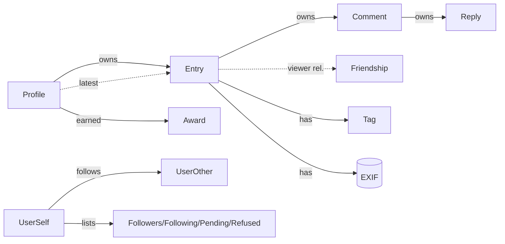

# Data model (language-neutral)

The domain entities the app reads and writes, in plain terms. This complements the conceptual
[glossary](../glossary.md): the glossary defines the *ideas*, this lists the *fields* the app
relies on. Exact wire names, types, and JSON shapes are in the **build-repo API spec** (source of
truth).

> **Ids are strings.** Entry (and similar) ids can exceed safe integer precision; treat all ids
> as strings end-to-end.

---

## Entry
The central object: a dated photo-journal post. Appears in two shapes.

**Grid/list shape** (feeds, search, journal, favourites): id, thumbnail, full-image URL, date,
title, owner username, optional latitude/longitude.

**Full shape** (single entry view): everything above plus —
- Owner: username, journal title, member flag.
- Content: title, description (raw BBCode + rendered HTML), tags (list).
- Images: thumbnail, low-res and **standard-res** URLs. Higher-resolution and original URLs exist
  in the response shape but are **null for this app** — they are populated only for trusted
  first-party apps, the same restriction that applies to additional photos. Treat standard
  resolution as the largest image obtainable, and never build UI that depends on the others being
  present. (**Additional photos are likewise not available** — see [endpoints.md](endpoints.md); an
  entry is single-photo as far as this app is concerned.)
- Location: latitude/longitude (when geotagged).
- Counts: views, stars, favourites.
- Camera metadata (EXIF): make, model, exposure time, f-number, focal length, ISO.
- Navigation: previous / next entry id within the journal.
- Comments: list of Comment (each with its replies).
- Viewer relationship: a Friendship to the owner.
- **Action flags** (what the current viewer may do): comment, star, favourite, edit, delete. The
  UI shows affordances strictly from these. (Add-photo / delete-photo flags may be present on the
  wire but are always ignored — the app cannot act on them.)

## Comment & Reply
A top-level **Comment** on an entry, owning a list of **Replies** (one level deep). Each carries:
id, commenter username, commenter badge icons, content (raw + rendered HTML), parent id (for
replies), and action flags (reply, **edit**, delete).

The **edit** flag is set for the comment's **own author only** — nobody edits anyone else's words.
The **delete** flag is broader: it is set both for the comment's own author and for the **owner of
the entry it sits on**, since a journal owner may delete any comment on their own entries. The two
flags are therefore not interchangeable, and the UI must drive each affordance from its own flag.

In the comments inbox a comment also carries the entry id and thumbnail and an unread flag.

## Profile
A member's public identity: username, avatar, journal title, biography (raw BBCode + rendered
HTML), country / country code, member flag, privacy flag, visibility (whether the viewer may see
it), entry count, badge icon ids, and a "latest entry" summary. Carries viewer-relative action
flags: follow / unfollow. Distinguishes own vs other member's profile.

## User (lightweight)
A person reference used in lists (followers, following, pending, refused, people-search): username
+ avatar.

## Friendship (follow relationship)
A **directional** follow ("subscribe") from one member to another: source, target, a relationship
state, and action flags (follow / unfollow). Drives the follow button's state.

## Award (badge)
A badge a member earned: id, icon URL, an added timestamp, and a "secret" flag (hidden until
earned).

## Notification
**Two different shapes, and the difference drives `SCR-23` and `SCR-24`.**

**A notification** (`SCR-23`) is: an id, **pre-rendered content** (raw and as formatted text), an
optional image, and a link. That is all. It carries **no activity type, no author, no timestamp and
no unread flag** — the text arrives already composed, and the member responsible is identifiable
only from within that text. Two consequences run through the spec: the app never composes
notification wording itself, and hidden-member suppression here is best-effort (`SCR-23`,
[`../rules.md`](../rules.md)). Destination is inferred from the link, which distinguishes an entry
from a profile reliably but does not identify a follow request as one — see `SCR-23` for that case.

**A received comment** (`SCR-24`) is the opposite: fully structured. It carries the **commenter**
(username and avatar), the comment text, the related entry, a comment-or-reply type, and an
**unread** flag. Filtering and routing are exact here.

**A push** carries neither shape — only which stream's unread total rose, and by how much. The
cloud service cannot read either stream's content without marking it read, so it doesn't try. See
[`../02-notifications.md`](../02-notifications.md) and
[`../../ImplementationSpec/notification-service.md`](../../ImplementationSpec/notification-service.md).

Items in both streams are **kept for around two weeks**, so neither inbox reaches further back.

## Settings entities
- **User settings** (editable account/profile): username, real name, journal title, biography
  (BBCode), country code, locale code, journal privacy, comments-allowed, find-by-name.
- **Notification settings**: two groups, each with a "configured" flag and per-event toggles —
  **feed** (friends activity, favourite received, star received, publish milestone, followers
  milestone, new award) and **push** (comment received, friends activity, favourite received,
  star received, publish milestone, followers milestone, new award, communications). In the new
  app these govern what the cloud service may push.

## Publish eligibility (journal day)
Not a stored entity — a query result for a given date: **can-publish** (yes/no) plus a **state**
explaining why not (e.g. already have an entry that day, date not yet reached). Backs the
one-per-day rule in compose. State definitions: see [open-questions.md](open-questions.md).

## Hidden members list
Client-side only; never sent to or returned by the API. Per account, stored on the device: the set
of members whose content is suppressed throughout the app (see [../rules.md](../rules.md)). Holds
enough to identify and display each member — username, plus a cached avatar and display name so
`SCR-31` can render the list without a network call. Hiding has no server-side representation, so
it does not survive a reinstall or transfer to another device.

Distinct from **refused followers**, which *are* server-side and are read from
`users/requests/blocked` (see [endpoints.md](endpoints.md)).

## Write-side (compose) models
Client-side only; never returned by the API.
- **New/edited entry payload**: chosen photo (with on-device EXIF and a generated downscaled
  copy), title, tags, description, date, optional location, optional square-crop (members only),
  GMT offset, and an upload status (to-upload → uploading → uploaded-ok / error). Used for
  publish, edit-details, and replace-photo.
- **Avatar upload payload**: chosen image + downscaled copy, for the profile picture.
- **Picked local photo**: a photo selected from the device (path, dimensions, EXIF date/location,
  orientation) used to seed the entry payload.

---

## Relationships

> Anything an implementation round-trips by id (entries, comments, awards, notifications)
> must keep that id as a **string**.
