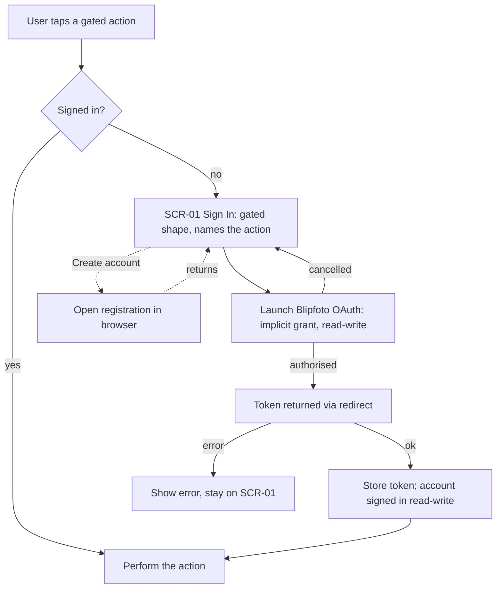

# FLW-01 — Sign in & resume gated action   [Must]

**Trigger:** An anonymous user taps an action that needs an account (post, star, favourite,
comment, follow, manage profile).
**Screens:** `SCR-01 Sign In` (gated-action shape, no mode choice) → returns to the originating
screen/action.

> Sign-in is Blipfoto OAuth, implicit grant; there is no email/password or social login, and
> registration happens in the browser. A gated action always signs in **read-write, notifications
> off** — no mode choice is shown. Deliberate sign-in (nav "Sign in", or "Add account") with the
> full four-mode choice is `FLW-20`, not this flow. See [auth.md](../api-appendix/auth.md).

## Diagram

## Steps, branches & rules
1. The app records the **pending action** and shows `SCR-01` in its gated shape, naming the
   reason — no mode choice is offered.
2. **Sign in** launches Blipfoto OAuth (implicit grant, scope read-write). The token is returned
   directly via the redirect — no separate code-exchange step.
3. **Success** → store the token securely (used as the bearer; effectively indefinite — no
   refresh), then **resume the pending action** and return to where the user was. This is the
   user's first account if they had none, or becomes the active account otherwise.
4. **Error / decline** → show a message / return to idle; no partial session stored.
5. **Create account** → opens Blipfoto registration in the browser; on return the user can sign
   in.
6. If sign-in was merely offered (not required), the user may continue browsing anonymously.

## Acceptance criteria
- [ ] A gated action by an anonymous user routes to `SCR-01`'s gated shape (no mode choice) and,
      on success, completes the original action.
- [ ] The resulting account is signed in read-write with notifications off, regardless of any
      other account's mode.
- [ ] OAuth failure/decline leaves no session and lets the user retry.
- [ ] "Create account" opens the browser, not an in-app form.
