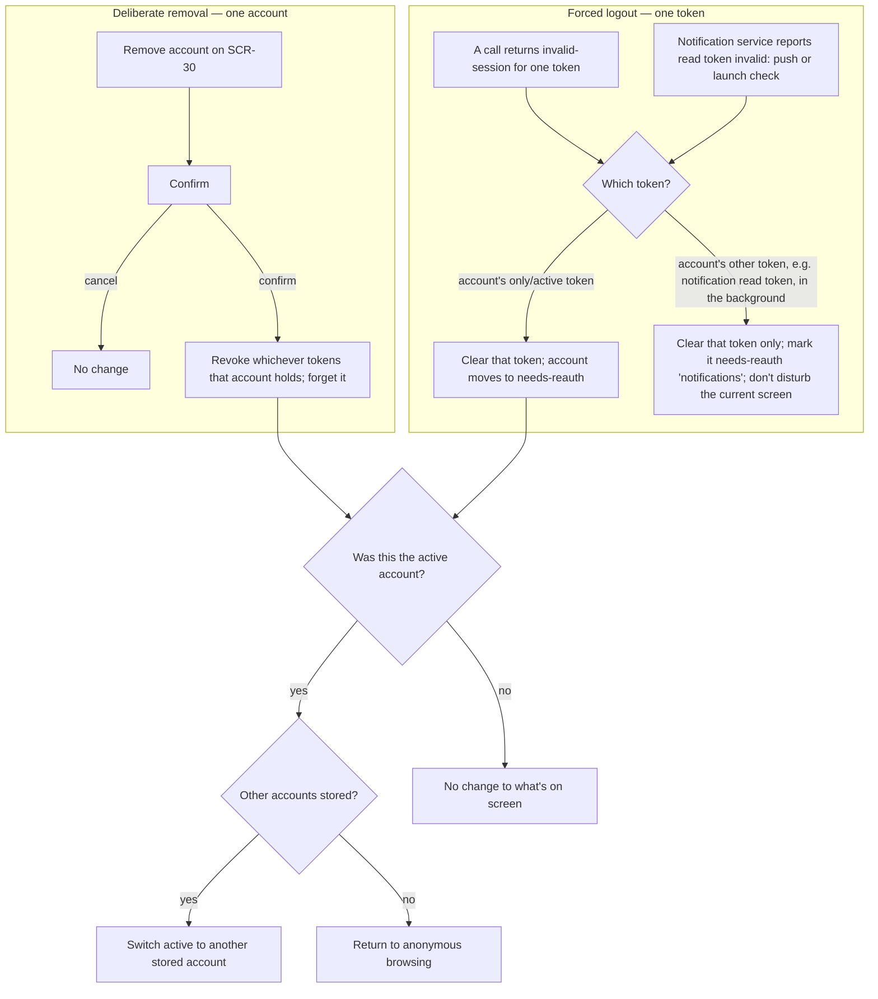

# FLW-02 — Remove account / forced logout   [Must]

**Trigger:** The user removes an account from `SCR-30`; **or** any API call returns the
invalid-session error code for one of an account's tokens; **or** the notification service reports
a registration's read token as invalid, via its `reauth-required` push or the app's launch-time
health check (see [`../../ImplementationSpec/notification-service.md`](../../ImplementationSpec/notification-service.md)).
**Screens:** any → account removed/needs-reauth, active account switches or the app goes
anonymous.

> **There is no separate "sign out".** With multiple accounts, signing out of one *is* removing
> it: both revoke that account's tokens and forget it. The app offers one operation, **Remove
> account**, on `SCR-30` (`FLW-22`) — this flow describes what happens when it runs, and what
> happens when the server invalidates a token without being asked.
>
> Both are **account- and token-scoped**, never global. The app may hold several accounts, each
> with up to two tokens (a read-write token for itself and, separately, a read-only token for the
> notification service). Removal and forced logout act on **one token, or one account's tokens**,
> never silently on every stored account. See [auth.md](../api-appendix/auth.md).

## Diagram

## Steps, branches & rules

1. **Deliberate removal (one account)** → confirm → revoke **whichever tokens that account
   currently holds** (one or two — see the token lifecycle in
   [auth.md](../api-appendix/auth.md)) and remove it from the stored account list; cancel any
   in-flight work that used its token (e.g. a queued upload). If the account had notifications
   enabled, **deregister it from the cloud notification service** as part of the same operation
   (see [02-notifications.md](../02-notifications.md)). The account disappears from `SCR-30`
   entirely — this is the distinction from a forced logout, which keeps the account and only
   drops a token.
2. **Forced logout (one token)** → triggered by the invalid-session error code on *any* call
   (see [error-codes.md](../api-appendix/error-codes.md)). Only the **specific token** that
   failed is cleared — an account with two tokens where only one fails keeps the other. The
   account is **not** removed from the stored list; it moves to a **needs-reauth** state (visible
   in `SCR-30`) so the user can quickly re-authorize rather than re-adding it from scratch
   (`FLW-20`/`FLW-22`).
3. **If the failing/removed token belonged to the active account and leaves it with no usable
   token**, the app switches the active account to another stored one, or returns to anonymous
   browsing if none remain — mirroring deliberate removal's "return to a usable state" behaviour.
4. **If the failing token belongs to a non-active account, or is a background token** (typically
   the notification service's read token going stale while the user is using a different active
   account, or not looking at the app at all), the app clears/flags it **without disturbing the
   current screen** — no interruption, no redirect; the affected account simply shows
   needs-reauth next time it's viewed in `SCR-30`.
   - **Detecting a stale service read token** happens two ways: the service's `reauth-required`
     push (the common case, near-instant), or the app's launch-time health check as a backstop for
     a missed push (see `../../ImplementationSpec/notification-service.md`). Both feed this same
     branch — there's no separate handling path for either source.
   - **In read-write + notifications this never narrows write access.** There the service holds a
     *separate* read token, not used for anything the app itself does, so the account stays fully
     read-write throughout — only notifications stop. `SCR-30`'s needs-reauth row carries a
     **reason label** ("notifications") so this doesn't read as a whole-account failure.
     Re-authorizing scopes to just that token, per `FLW-22`.
   - **In read-only + notifications it is not a background event at all.** That mode has a single
     token, shared by the app and the service (see [auth.md](../api-appendix/auth.md)), so a
     stale-token report means the account has no working credential: handle it as an ordinary
     whole-account forced logout down the branch above, with no notifications-specific label.
     The distinction is which mode the account is in, not which source reported the failure.
5. Whenever the app has **no active account** (all removed, or none ever signed in), it returns
   to a **logged-out state**: account-required screens close or revert; others re-render as
   anonymous (still able to browse public content via the app-level bearer).

## Acceptance criteria
- [ ] Removing an account confirms, revokes whichever tokens it holds, deregisters it from the
      notification service if registered, and removes it from the stored account list; in-flight
      work using its token is cancelled.
- [ ] There is no separate "sign out" control anywhere in the app — removal is the only operation.
- [ ] An invalid-session code clears only the specific token that failed; the account moves to
      needs-reauth rather than being removed, and keeps any other still-valid token it holds.
- [ ] A forced logout on a non-active or background token never interrupts the screen the user is
      currently on.
- [ ] A notification-service-reported stale read token (push or launch check) triggers the same
      background-token handling as an invalid-session error; the account keeps full write access
      and `SCR-30` labels the needs-reauth reason as notifications-specific.
- [ ] Losing the active account's only/last token switches the active account to another stored
      one, or to anonymous browsing if none remain.
- [ ] With no active account, account-required screens close/revert and public browsing still
      works.
