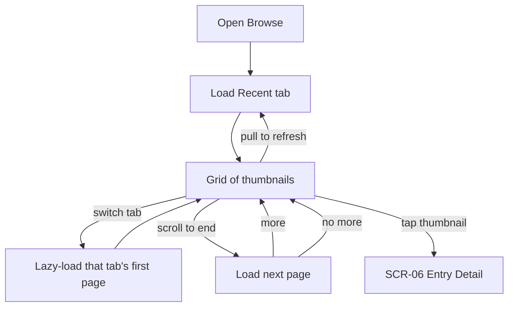

# FLW-03 — Browse & discover   [Must]

**Trigger:** Open the app / the Browse destination.
**Screens:** `SCR-02 Browse` → `SCR-06 Entry Detail`.

## Diagram

## Steps, branches & rules
1. Recent loads on open; other tabs lazy-load on first view. Tab set depends on sign-in state and
   changes live on sign-in/out (`FLW-01`/`FLW-02`).
2. **Pull-to-refresh** resets the active tab to page one; **scroll** pages until exhausted.
3. **Empty** tabs (e.g. Following with no followees) show a helpful prompt; **errors** offer retry;
   **Nearby** prompts for location permission.
4. **Tap** a thumbnail → `SCR-06` (continues in `FLW-05`).

## Acceptance criteria
- [ ] Recent loads on open; other tabs load on first view.
- [ ] Refresh and pagination behave per [rules.md](../rules.md).
- [ ] Tab set reflects sign-in state and updates on sign-in/out.
- [ ] Tapping a thumbnail opens the entry.
