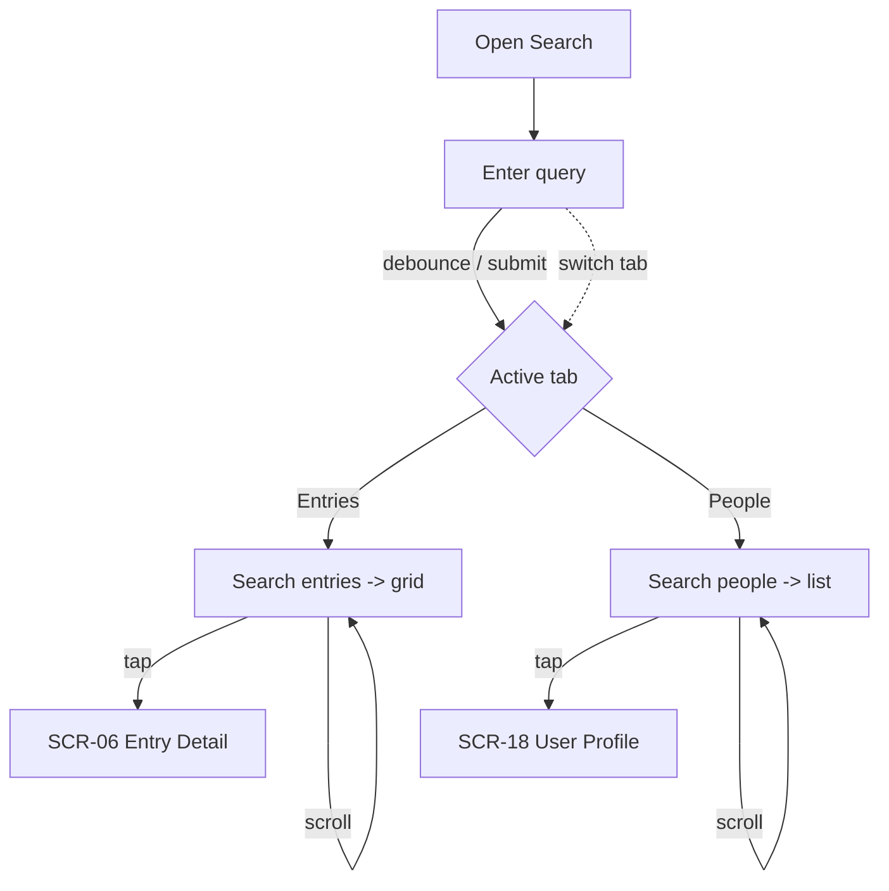

# FLW-04 — Search entries & people   [Must]

**Trigger:** Open Search / tap the search action.
**Screens:** `SCR-03 Search` → `SCR-06 Entry Detail` / `SCR-18 User Profile`.

## Diagram

## Steps, branches & rules
1. Typing triggers a debounced search of the active tab (non-empty term only); the keyboard search
   action searches immediately.
2. Switching tabs searches the new tab for the current term if it has no results.
3. Results page on scroll; empty queries show a neutral prompt; no matches show an empty state.
4. **Tap** an entry → `SCR-06` (`FLW-05`); **tap** a person → `SCR-18`.

## Acceptance criteria
- [ ] A non-empty query searches the active tab (debounced or on submit).
- [ ] Switching tabs searches the new tab for the current term.
- [ ] Results page on scroll; empty/no-match states are distinct.
- [ ] Tapping a result opens the right screen.
