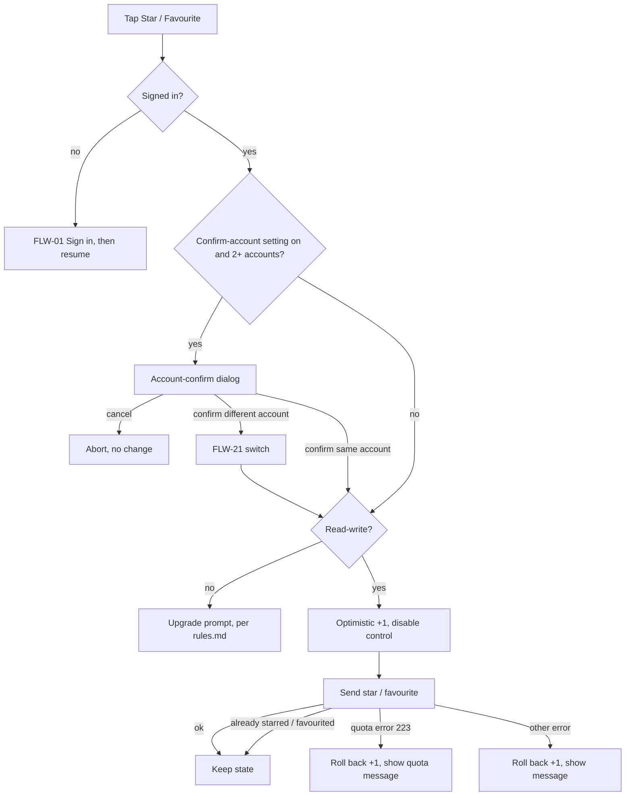

# FLW-06 — Star / favourite   [Must]

**Trigger:** Tap Star or Favourite on `SCR-06 Entry Detail`.
**Screens:** within `SCR-06`.

## Diagram

## Steps, branches & rules
1. Anonymous → `FLW-01`, then resume.
2. **If the "confirm account before Star/Favourite/comment" setting is on and 2+ accounts are
   stored** (`SCR-25` Misc, [rules.md](../rules.md) Multi-account clarity), show the
   account-confirm dialog before the read-write check — this lets a user whose active account is
   read-only pick an already-read-write one instead of hitting the upgrade prompt. Confirming a
   different account switches to it first (`FLW-21`); confirming the current one, or the setting
   being off, proceeds straight through. Cancelling aborts with no change.
3. Signed in but read-only (of whichever account is now active) → the write-gating upgrade prompt
   (`rules.md`), never a bare error or an attempted call — the affordance is normally hidden, so
   this only fires if reached anyway.
4. **Optimistic +1** immediately; send the reaction.
5. **"Already starred" / "already favourited" are not failures** — they mean the action's effect is
   already in place (a double-tap, or acting from a stale screen). Treat them as success: keep the
   optimistic state, show no error, don't retry. Only a genuine refusal rolls back.
6. **Favourite** daily-quota error (223) → roll back and show the quota message; other errors →
   roll back and show a generic message. **Star** errors → roll back and show a message.
7. Visible counts that changed roll back on failure (per [rules.md](../rules.md)) — with the
   already-applied codes above excluded, since nothing failed.

## Acceptance criteria
- [ ] Star/Favourite update the count immediately and persist on success.
- [ ] An "already starred"/"already favourited" response leaves the optimistic state in place and
      shows no error.
- [ ] Favourite quota (223) rolls back with its specific message.
- [ ] Other errors roll back the optimistic change with a message.
- [ ] Anonymous users are routed through sign-in first.
- [ ] A signed-in, read-only account sees the upgrade prompt instead of the star/favourite
      affordance ever being offered.
- [ ] With the confirm-account setting on and 2+ accounts stored, the account-confirm dialog is
      shown before the read-write check; confirming a different account switches to it first;
      cancelling makes no change.
- [ ] With the setting off, or only one account stored, no dialog appears.
