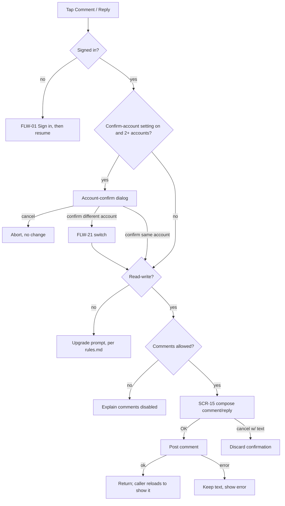

# FLW-07 — Comment / reply   [Must]

**Trigger:** Tap Comment on `SCR-06`, Reply on a comment (`SCR-06`/`SCR-24`).
**Screens:** `SCR-06`/`SCR-24` → `SCR-15 New Comment` → back.

## Diagram

## Steps, branches & rules
1. Anonymous → `FLW-01`.
2. **If the "confirm account before Star/Favourite/comment" setting is on and 2+ accounts are
   stored** (`SCR-25` Misc, [rules.md](../rules.md) Multi-account clarity), show the
   account-confirm dialog before the read-write check and before `SCR-15` opens — this lets a
   user whose active account is read-only pick an already-read-write one instead of hitting the
   upgrade prompt. Confirming a different account switches to it first (`FLW-21`); confirming the
   current one, or the setting being off, proceeds straight through. Cancelling aborts with no
   change.
3. Signed in but read-only (of whichever account is now active) → the upgrade prompt (`rules.md`),
   checked before the comments-allowed check. If the journal disallows comments, explain and stop.
4. Compose in `SCR-15` (BBCode + toolbar); a reply is tied to its parent comment.
5. **OK** posts; on success the caller (`SCR-06`/`SCR-24`) reloads to show the new comment/reply.
6. On error, keep the text and show a message; cancelling with text confirms discard.
7. **Editing** one's own comment or reply reuses `SCR-15`, seeded with the existing text, and
   commits as an update rather than a new comment. Offered only on one's own, per the comment's
   **edit** action flag.
8. **Deleting** a comment or reply happens inline on `SCR-06`, not here: available on one's own
   comments anywhere, and on **any** comment on one's own entry (the journal owner moderates their
   own journal). Driven by the comment's **delete** action flag — a wider set than edit — then
   confirmed and applied optimistically.
9. **Reporting** a comment also happens inline on `SCR-06`, via `SCR-16` (`FLW-11`).

## Acceptance criteria
- [ ] Posting a comment/reply shows it on return.
- [ ] A reply is attached to the correct parent.
- [ ] Editing one's own comment replaces its text; edit is never offered on someone else's comment,
      including on one's own entry.
- [ ] Errors preserve the text; cancel-with-text confirms discard.
- [ ] Anonymous users sign in first; comments-disabled is explained.
- [ ] A signed-in, read-only account sees the upgrade prompt instead of `SCR-15` ever opening.
- [ ] With the confirm-account setting on and 2+ accounts stored, the account-confirm dialog is
      shown before `SCR-15` opens; confirming a different account switches to it first; cancelling
      makes no change.
- [ ] With the setting off, or only one account stored, no dialog appears.
