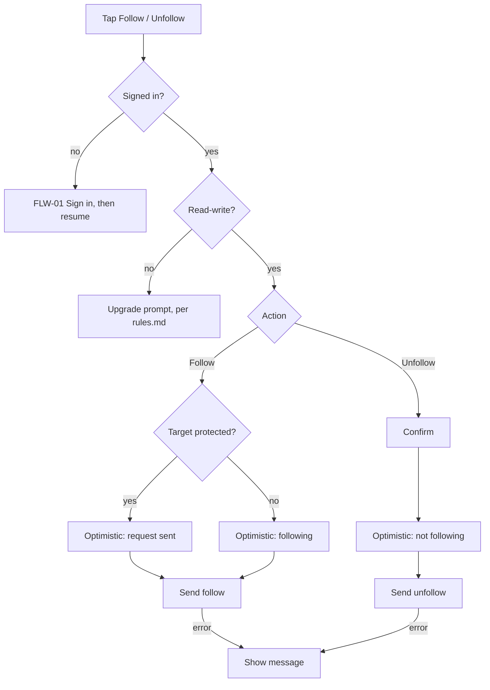

# FLW-08 — Follow / unfollow   [Must]

**Trigger:** Tap Follow/Unfollow on `SCR-06 Entry Detail` or `SCR-18 User Profile`.
**Screens:** within `SCR-06` / `SCR-18`.

## Diagram

## Steps, branches & rules
1. Anonymous → `FLW-01`. Signed in but read-only → the upgrade prompt (`rules.md`).
2. **Follow** updates optimistically; for a **protected** target it becomes a **pending request**
   (the target approves via `FLW-09`).
3. **Unfollow** confirms, then updates optimistically.
4. Errors show a message; the relationship generally isn't reverted (see [rules.md](../rules.md)).

## Acceptance criteria
- [ ] Follow updates immediately; unfollow confirms first.
- [ ] Following a protected account creates a pending request.
- [ ] Errors surface a message.
- [ ] Anonymous users sign in first.
- [ ] A signed-in, read-only account sees the upgrade prompt instead of the Follow/Unfollow
      affordance ever being offered.
