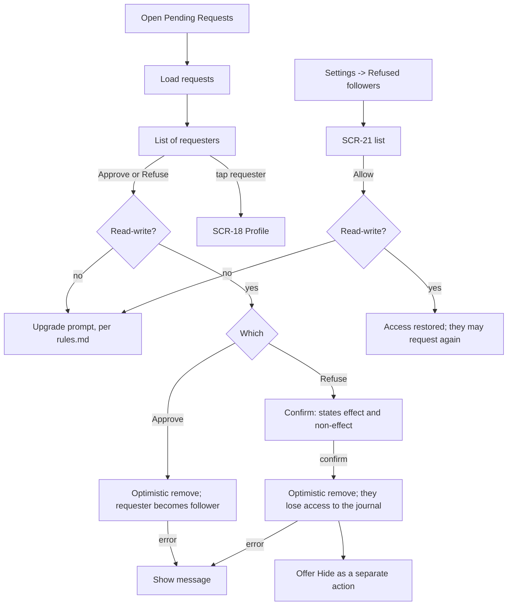

# FLW-09 — Approve / refuse follow requests   [Must]

**Trigger:** Open Pending Requests (protected journal) or a follow-request push; or manage
existing refusals in Settings.
**Screens:** `SCR-20 Pending Requests`; `SCR-21 Refused Followers`.

> Refusing stops **them** seeing **you**. It is the outward-facing safety feature, available only
> on a protected journal. Hiding (`FLW-10`, `SCR-31`) is the opposite and separate feature: it
> stops **you** seeing **them**. Neither implies the other — see [rules.md](../rules.md).

## Diagram

## Steps, branches & rules

1. Load pending requests (paged) — a read, available read-only. Empty → "No pending requests".
2. **Approve, Refuse, and Allow (restore access) are all writes**, gated on read-write; a
   read-only account sees the upgrade prompt (`rules.md`) instead. Only the list and the profile
   link stay available read-only.
3. **Approve** removes the row optimistically; the requester becomes a follower and can see the
   journal.
4. **Refuse** removes the row optimistically and denies them access. The confirmation states
   **both halves**:
   - *They won't be able to see your journal.*
   - *This doesn't hide their entries from you.*
5. **After refusing, offer Hide** as a separate, clearly-labelled action — if what the user
   actually wanted was to stop seeing that member, refusing alone does not achieve it (`FLW-10`).
6. Refused members are listed on `SCR-21`, where access can be restored. Restoring does not make
   them a follower; they may send a fresh request, which returns here.
7. **Removing an existing follower** (`SCR-19`) is a *different* operation, not a second route to
   the same place — also a write, gated the same way, but it does **not** refuse anyone and never
   adds a row to `SCR-21`. On a protected journal the removed member loses access and may send a
   fresh follow request, which arrives back here; refusing *that* request is what makes them a
   refused member. On a public journal they can simply follow again. See
   [rules.md](../rules.md).
8. **Tap** a requester → `SCR-18`. Their entries remain visible to you throughout; refusing never
   changed that.
9. Only relevant for protected journals — a public journal has no requests to approve and nothing
   to refuse.

## Acceptance criteria
- [ ] Requests list with Approve and Refuse.
- [ ] Approve makes the requester a follower; Refuse removes their access — both remove the row.
- [ ] The Refuse confirmation states both the effect and the non-effect, in those terms.
- [ ] After refusing, Hide is offered as a separate action, never applied automatically.
- [ ] A refused member appears on `SCR-21`, and restoring access allows a fresh request later.
- [ ] Removing an existing follower (`SCR-19`) does not add them to `SCR-21`, and is never
      described to the user as refusing or blocking them.
- [ ] A refused member's entries remain fully visible to the person who refused them.
- [ ] Errors surface a message; tapping a requester opens their profile.
- [ ] A signed-in, read-only account sees the upgrade prompt instead of Approve, Refuse, or Allow
      ever being offered; the list itself and viewing a requester's profile stay available.
