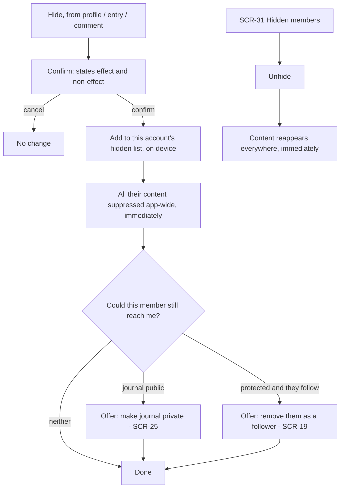

# FLW-10 — Hide / unhide a member   [Must]

**Trigger:** **Hide** from a member's profile (`SCR-18`), from an entry's overflow menu (`SCR-06`),
or from a comment (`SCR-06`, `SCR-24`). **Unhide** from `SCR-31 Hidden Members`, or from the hidden
state on a profile or entry.
**Screens:** `SCR-18` / `SCR-06` / `SCR-24` (hide) ; `SCR-31` (view and unhide).

> Hiding stops **you** seeing **them**. It is enforced entirely by the app — Blipfoto's API has no
> equivalent — and it changes nothing server-side. Refusing a follower (`FLW-09`, `SCR-21`) is the
> opposite and separate feature: it stops **them** seeing **you**. Full suppression rule in
> [rules.md](../rules.md).

## Diagram

## Steps, branches & rules

1. **Hide** is offered wherever another member's content or identity appears — their profile, an
   entry they own, or a comment they wrote. It is never offered for the active account itself.
2. **Confirm first**, and the confirmation states **both halves**:
   - *You won't see their entries, comments or notifications.*
   - *This doesn't stop them seeing your journal or commenting on your entries.*

   The second line is the point of the dialog. Users arrive expecting a mutual block; if this
   sentence is dropped, the feature actively misleads them.
3. **Offer the complementary steps, as separate labelled choices** — never bundled into the hide
   itself. Show only what is actually applicable to this member and this journal:
   - Journal is **public** → *"Make your journal private"* → `SCR-25` → Journal → privacy.
   - Journal is **protected** and they **follow it** → *"Remove them as a follower"* → `SCR-19`.
     This removes their access; it does **not** refuse them, and they do not appear on `SCR-21`.
     Say so: they can ask to follow again, and that request can be refused when it arrives
     (`SCR-20`). Never label this action "Refuse" — there is no pending request to refuse.

   Where neither applies — a protected journal they don't follow — they already cannot see
   anything, and the dialog should say so rather than offering a pointless action.
4. **Say plainly what a full cut-off actually takes.** Making the journal private, removing them as
   a follower, refusing any fresh request they send, and hiding them stops them seeing anything and
   stops you seeing them. Be honest that it is a sequence rather than one switch — the refusal step
   only becomes available if they ask again.
5. **Suppression takes effect immediately and everywhere** — the current screen updates without a
   reload, and every other surface reflects it next time it renders.
6. Offer a brief **Undo** immediately after hiding, in case of a mis-tap.
7. **Unhide** is immediate, needs no confirmation, and restores their content everywhere. It
   changes nothing about follow relationships or refusals, which were never touched.
8. **Hiding is per account and device-local.** Switching the active account switches the hidden
   list; it does not travel to another device or survive a reinstall. Don't imply otherwise.

## Acceptance criteria
- [ ] Hide is reachable from a member's profile, from an entry they own, and from a comment they
      wrote; it is never offered for the active account.
- [ ] The confirmation states both the effect and the non-effect, in those terms.
- [ ] The confirmation offers only the complementary actions that actually apply, as separate
      choices — hiding never silently changes privacy or follower state.
- [ ] After hiding, none of that member's entries or comments appear anywhere in the app, and
      notifications caused by them are suppressed from the inboxes wherever they can be recognised
      (exactly in the comments inbox; best-effort in the notifications inbox — see `SCR-23`).
- [ ] A push is still raised, and correctly names nobody — suppression is an inbox behaviour, not a
      push one (`FLW-16`).
- [ ] A hidden member's entries appear in grids as a placeholder rendering neither their
      photograph nor their title.
- [ ] View/star/favourite counts are unchanged by hiding.
- [ ] Unhide restores their content immediately and alters no follow relationship or refusal.
- [ ] Switching the active account switches which hidden list is in force.
