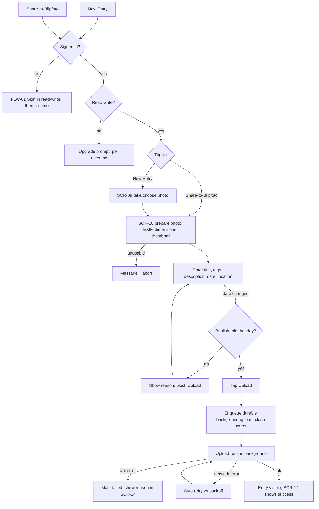

# FLW-12 — Compose & publish an entry   [Must]

**Trigger:** "New Entry" in navigation, or OS **Share-to-Blipfoto** (lands mid-flow with the shared
photo; account-gated).
**Screens:** `SCR-09 New Entry` → `SCR-10 Compose Entry Details` (→ `SCR-11`, `SCR-12`) →
`SCR-14 Upload Progress`.

## Diagram

## Steps, branches & rules
1. **Account- and read-write-gated**, identically for both entry points. Anonymous → `FLW-01`,
   which always signs in read-write and resumes here (per [rules.md](../rules.md)). Signed in but
   read-only → the upgrade prompt, never a silent drop into compose; declining leaves
   Share-to-Blipfoto's share sheet dismissed / navigation unchanged, same as tapping New Entry and
   backing out. Pick/take a photo (`SCR-09`) for New Entry; Share-to-Blipfoto enters directly at
   `SCR-10` with the shared photo, skipping `SCR-09`.
2. `SCR-10` prepares the photo; unusable (wrong type / too small) → message + abort.
3. Set details; **each date change re-checks publish eligibility** (one-per-day rule). An
   ineligible date shows the reason and blocks Upload.
4. **Upload** enqueues a **durable background upload** and closes the screen. The upload survives
   leaving the screen, **auto-retries on network failure** (capped backoff), and stops with a
   surfaced message on an application error.
5. Progress/outcome is visible in `SCR-14`; on success the new entry is viewable.

## Acceptance criteria
- [ ] Anonymous users sign in read-write first (both entry points); Share-to-Blipfoto enters at
      `SCR-10` with the shared photo, skipping `SCR-09`.
- [ ] A signed-in, read-only account reaching either entry point — including via
      Share-to-Blipfoto, which bypasses the app's own New Entry nav item — sees the upgrade prompt
      instead of compose ever opening.
- [ ] An ineligible date shows its reason and blocks Upload until a publishable date is chosen.
- [ ] Upload continues after the compose screen closes and recovers from network failure.
- [ ] An application error marks the upload failed with a reason; success makes the entry viewable.
