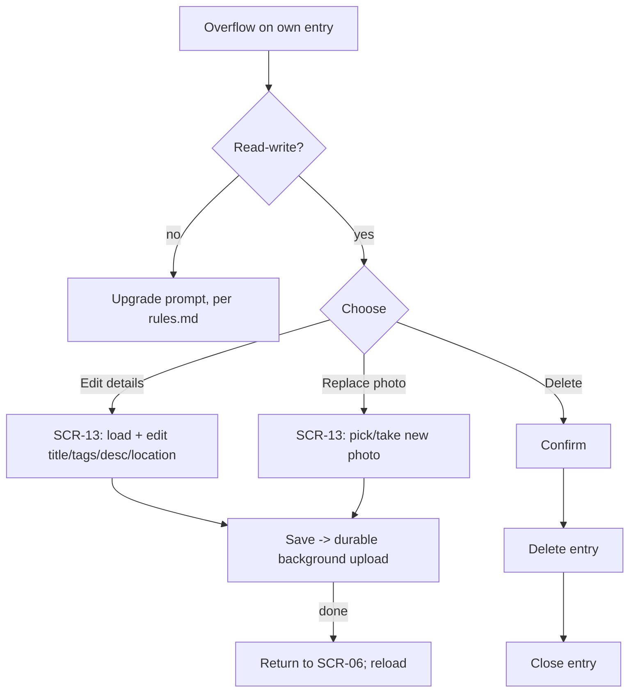

# FLW-13 — Edit / delete an entry   [Must]

**Trigger:** `SCR-06 Entry Detail` overflow menu (owner only, per action flags).
**Screens:** `SCR-06` → `SCR-13 Edit Entry` (→ `SCR-11`, `SCR-12`) → back to `SCR-06`.

## Diagram

## Steps, branches & rules
1. Offered only for entries the viewer owns (action flags) **and only read-write** — ownership
   doesn't imply write access; a read-only owner sees the upgrade prompt (`rules.md`) instead of
   `SCR-13` ever opening or Delete's confirm ever appearing.
2. **Edit details / Replace photo** → enqueue a **durable background upload** (same machinery as
   compose; survives leaving the screen, retries on network failure).
3. **Delete entry** → confirm → on success close the entry.
4. On return, `SCR-06` reloads to reflect changes.
5. Additional photos are out of scope — the app can neither add nor remove them (see
   [api-appendix/endpoints.md](../api-appendix/endpoints.md)).

## Acceptance criteria
- [ ] Edit/delete are available only to the owner.
- [ ] A read-only owner sees the upgrade prompt instead of Edit/Replace/Delete ever being offered.
- [ ] Detail edits and photo replacement commit via background upload and show on return.
- [ ] Deleting the entry confirms, then closes it.
