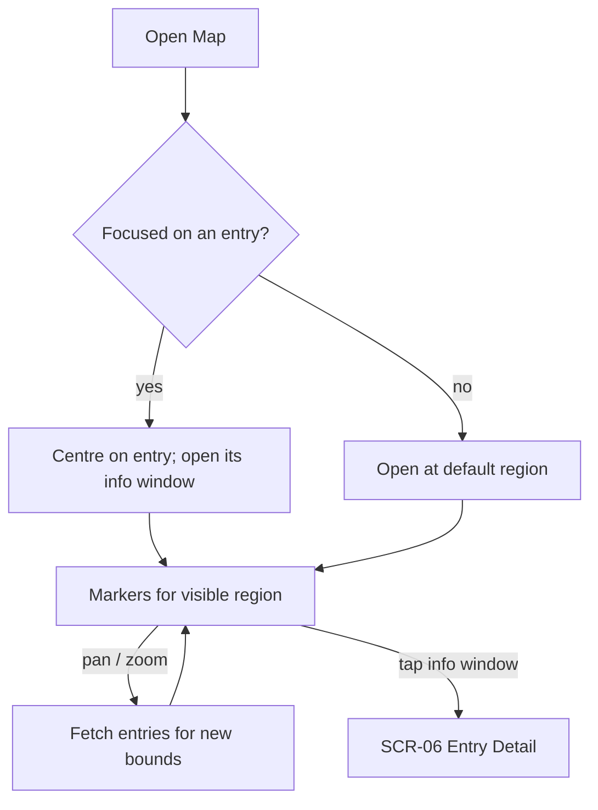

# FLW-14 — Browse on the map   [Should]

**Trigger:** Open the Map destination, or "Map" from a geotagged entry.
**Screens:** `SCR-04 Map` → `SCR-06 Entry Detail`.

## Diagram

## Steps, branches & rules
1. General map opens at a default region; entry-focused map centres on that entry.
2. Pan/zoom fetches entries for the visible bounds (cancel in-flight; be rate-limit aware).
3. Empty regions show no markers (no error); tap an info window → `SCR-06`.

## Acceptance criteria
- [ ] Panning/zooming loads markers for the visible region.
- [ ] Entry-focused mode centres and opens the entry's info window.
- [ ] Tapping a marker's info window opens the entry.
