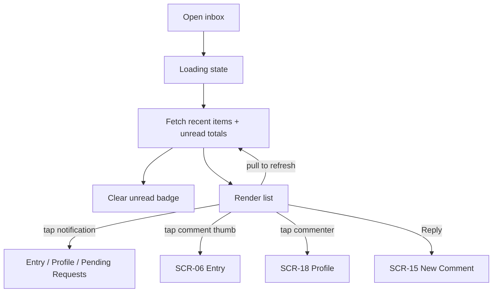

# FLW-15 — Notifications & comments inboxes   [Must]

**Trigger:** Open the Notifications or Comments inbox (badge tap); pull-to-refresh.
**Screens:** `SCR-23 Notifications Inbox`, `SCR-24 Comments Inbox`.

> Notification *delivery* is via the cloud service; inbox *content* is recent activity read
> directly from the Blipfoto `messages` endpoints. See
> [02-notifications.md](../02-notifications.md).

## Diagram

## Steps, branches & rules
1. Inboxes are **fetched fresh on open** — no cached list is shown, per the caching rule in
   [rules.md](../rules.md). Fetch recent items and unread totals, using the `since_id` cursor on a
   refresh so only new items come back.
2. Opening an inbox **clears its unread badge** optimistically, and the read state persists on the
   server — the unread total is shared with the website, so a local-only clear would reappear on
   the next fetch. **Both inboxes clear implicitly**: fetching the items is itself what marks them
   read, on either stream, with no per-item control and no separate call to make. Comments clear
   more broadly than notifications do — see `SCR-24`. A new push refreshes counts.
3. Targets: a notification opens its entry or profile, or `SCR-20` where it concerns a follow
   request; a comment's thumbnail opens the entry, the commenter opens their profile, and Reply
   opens `SCR-15` (`FLW-07`).
4. A notification whose target can't be determined opens its link in the device browser rather than
   doing nothing.

## Acceptance criteria
- [ ] Opening an inbox fetches fresh, showing a loading state rather than a stale list.
- [ ] Opening an inbox clears its badge and the clear survives the next totals fetch; a new push
      updates counts.
- [ ] Notification/comment taps open the correct targets; Reply targets the right comment.
