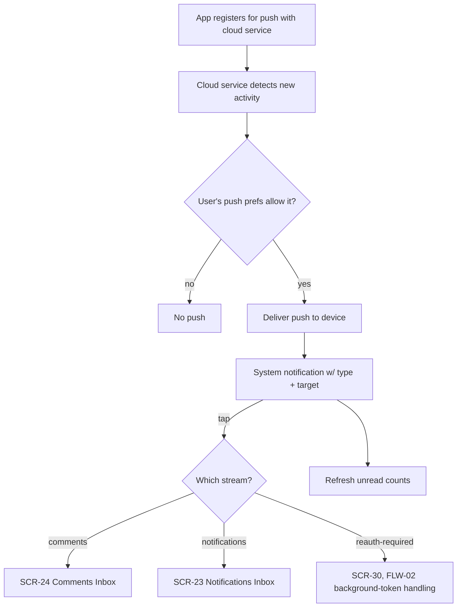

# FLW-16 — Receive a push notification   [Must]

**Trigger:** The cloud service delivers a push reporting that an unread total has risen (comments
or notifications); **or** the service's `reauth-required` system alert (its read token for this
account has died).
**Screens:** system notification → `SCR-23`, `SCR-24`, or (system alert) `SCR-30`.

> Pushes come from the **cloud service**, which the app registers with — not from Blipfoto. The
> service detects activity by polling `messages/totals/unread` — **the only source it can read
> without marking the user's items read**, which is why a push reports a count rather than an event.
> The service's own design is out of scope here. See [02-notifications.md](../02-notifications.md).

## Diagram

## Steps, branches & rules
1. Whenever an account **enables notifications** (`FLW-20`, or turning them on later via `FLW-22`),
   the app **registers for push with the cloud service**; it deregisters whenever they go off — by
   the master switch, by account removal, or by OS-permission denial. There is no "sign-out" event
   to hang this on: removal is the operation (`FLW-02`). Push respects the user's notification
   preferences (`SCR-25` Notifications).
   Whenever the OS issues a new device push token (FCM token rotation), the app updates the
   registration with the service — otherwise pushes silently stop reaching the device. See
   [`../../ImplementationSpec/notification-service.md`](../../ImplementationSpec/notification-service.md).
2. **An incoming push reports a count, not an event** — which stream's unread total rose, and by
   how much (e.g. *"2 new comments"*). It carries no activity type, no target and no actor, because
   the service cannot obtain them: every Blipfoto call that returns notification or comment content
   marks it read, so a service that fetched detail would clear the user's badge before they saw it.
3. **Tapping opens the corresponding inbox** — `SCR-24` for comments, `SCR-23` for notifications —
   where the items are fetched and, in the process, marked read. That is the correct moment to
   clear the badge. If the user isn't signed in, route via `FLW-01`.
4. Receiving a push **refreshes unread counts** for the inboxes (`FLW-15`).
5. **Pushes are ordinary system notification messages**, displayed by the OS whether or not the app
   is running.
6. **A push caused by a hidden member is not suppressed** — an accepted limitation, and a mild one.
   The payload identifies nobody, so no hidden member's identity can leak; the cost is a
   notification about activity the user will not then be shown. Suppression happens where the app
   holds the actual items: in the inboxes (`SCR-23`, `SCR-24`) and on every content surface. The
   hidden list stays device-local and is never sent to the service.
7. **A `reauth-required` system alert isn't an activity push** — it carries no type/target/actor
   triple. Tapping it opens `SCR-30` with the affected account's needs-reauth state already
   surfaced; receiving it (tap or not) feeds `FLW-02`'s background-token forced-logout handling
   immediately, not just on next `SCR-30` visit.
8. **On every app launch**, for each stored account with notifications nominally on, the app runs a
   backstop check: OS notification permission still granted, and (via
   `GET /v1/registrations/:id`) the service's registration still healthy. Either check failing is
   handled exactly as if the corresponding push/decision had already happened — no separate state,
   no waiting for the user to notice. See
   [`../../ImplementationSpec/notification-service.md`](../../ImplementationSpec/notification-service.md),
   `FLW-02`, `FLW-22`.

## Acceptance criteria
- [ ] The app registers with the cloud service whenever an account enables notifications, and
      deregisters whenever they go off (switch, removal, or OS-permission denial).
- [ ] A device push token rotation (new FCM token from the OS) updates the existing registration
      with the service rather than leaving it stale.
- [ ] Pushes respect the user's notification preferences.
- [ ] A push states which stream rose and by how much, and names no member.
- [ ] Tapping a push opens that stream's inbox (`SCR-23` or `SCR-24`), signing in if needed.
- [ ] A received push refreshes unread counts.
- [ ] A push caused by a hidden member is **displayed** — suppression happens in the inbox, not on
      receipt — and reveals nothing about who caused it.
- [ ] A `reauth-required` system alert routes to `SCR-30` on tap and triggers `FLW-02`'s
      background-token handling regardless of whether it's tapped.
- [ ] Every app launch checks OS notification permission and service registration health for each
      account with notifications nominally on, and resolves either failure the same way the
      corresponding push/decision would.
