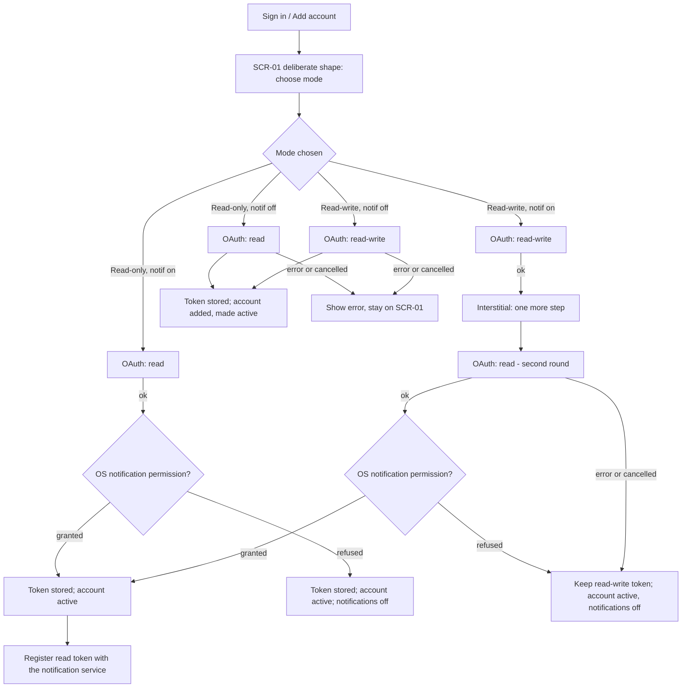

# FLW-20 — Add account & choose sign-in mode   [Must]

**Trigger:** "Sign in" from primary navigation (no account yet); or "Add account" from `SCR-30`.
**Screens:** `SCR-01` (deliberate shape) → for Read-write + Notifications, a second
authorization round → `SCR-30` / wherever sign-in was reached from, with the new account active.

> See [auth.md](../api-appendix/auth.md) for the mode/token model this flow implements.

## Diagram

## Steps, branches & rules
1. `SCR-01` shows the full mode choice (Read-write / Read-only, notifications toggle),
   defaulting to Read-write, notifications off.
2. **Read-only or Read-write, notifications off** — a single OAuth (implicit grant) round for the
   chosen scope. On success, the token is stored, a new account entry is created (or an existing
   one signed back in), and it becomes the **active** account.
3. **Read-write + notifications** — two sequential, separately visible OAuth rounds: first
   read-write (for the app itself), then an explicit interstitial, then read (for the
   notification service). Neither is hidden behind the other — see
   [auth.md](../api-appendix/auth.md). If the *second* round fails or is cancelled, the first
   token is kept: the account is signed in read-write, simply without notifications enabled; the
   user is not dropped back to a blank sign-in.
4. **Read-only + notifications** — a single OAuth round (read); the same token serves both the
   app and the notification service, since both only need read access. **This is the one mode where
   the two are the same token**, and it has a consequence worth being deliberate about: if that
   token later dies, the account loses everything, not just notifications. `FLW-02` and `SCR-30`
   must treat it as a whole-account forced logout rather than a background notifications failure —
   see [auth.md](../api-appendix/auth.md) (How many tokens each mode holds).
5. **Enabling notifications requires the OS notification permission, and it is settled *before* the
   read-token authorization**, not after — there is no point asking the user to authorize a token
   for pushes the OS won't display. Three cases, per [rules.md](../rules.md):
   - **Not yet asked** → show the permission request. Granted → continue to the read-token round.
   - **Granted already** → continue straight to the read-token round.
   - **Already refused** → the platform will not prompt again, so don't try. Explain that
     notifications are off for the app in system settings and offer to open them; re-check on
     resume. Until it's granted, the sign-in completes **without** notifications.
   **A refusal is treated exactly like a failed/cancelled notifications authorization** — the
   account still signs in (Read-write without notifications, or plain Read-only), no registration
   is made with the service, and nothing about the refusal is remembered as a "try again later"
   state; re-enabling later goes through this same sequence again.
6. On success, the app **registers with the cloud notification service** — read token, device push
   token, and platform — as specified in
   [`../../ImplementationSpec/notification-service.md`](../../ImplementationSpec/notification-service.md); out of scope here beyond
   noting it happens as part of this flow.
7. **Any OAuth error/decline on a first-and-only round** → show a message, stay on `SCR-01`, no
   partial session stored.
8. **Create account** → opens Blipfoto registration in the browser; on return the user restarts
   this flow.

## Acceptance criteria
- [ ] All four sign-in modes are reachable and each requests exactly the tokens
      [auth.md](../api-appendix/auth.md) specifies for it.
- [ ] Read-write + notifications always shows two distinct authorization steps, never a single
      combined one.
- [ ] A failed/cancelled second (notifications) authorization leaves the account signed in
      read-write, not signed out entirely.
- [ ] A successful sign-in adds/updates the account and makes it the active one.
- [ ] A successful notifications-enabled sign-in results in the read token being registered with
      the notification service.
- [ ] Enabling notifications settles the OS permission before running the read-token
      authorization, never after.
- [ ] Where the permission has already been refused, the app explains and offers system settings
      instead of issuing a request that cannot prompt — and never runs an authorization round whose
      token it is about to revoke.
- [ ] A refusal leaves the account signed in without notifications, the same way a
      failed/cancelled second OAuth round does, with no registration made and nothing remembered
      for next time.
