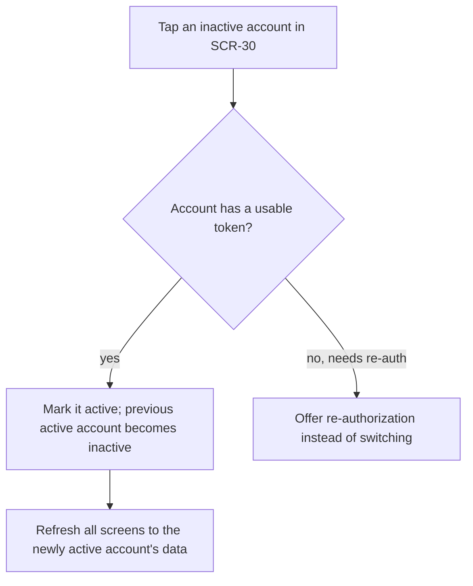

# FLW-21 — Switch account   [Must]

**Trigger:** Tapping an inactive account row in `SCR-30`; tapping an inactive account in the
account switcher popover (nav chrome, whenever two or more accounts are stored); confirming a
different account in the optional Star/Favourite/comment account-confirm dialog (`FLW-06`,
`FLW-07`) — see [rules.md](../rules.md) (Multi-account clarity).
**Screens:** `SCR-30`, or the switcher popover over any screen → wherever the user returns to /
was already on, now reflecting the newly active account.

> See [auth.md](../api-appendix/auth.md) for the multi-account token model.

## Diagram

## Steps, branches & rules
1. Switching is **local and instant** — no network call, no authorization step. It only changes
   which stored token(s) the app uses as bearer.
2. The previously active account is simply marked inactive; its token(s) are untouched (not
   revoked — see [auth.md](../api-appendix/auth.md), only downgrade/removal/logout revoke
   tokens).
3. Every screen that shows account-specific data (feeds, profile, notifications, settings)
   re-fetches/re-renders for the newly active account.
4. An account in **needs-reauth** state (`FLW-02`) cannot simply be switched to — tapping it
   offers re-authorization for the missing token instead (this is the same interaction, just
   with an extra step first).
5. Exactly one account is active at any time; anonymous browsing is the state with none.

## Acceptance criteria
- [ ] Switching to an inactive, fully-authorized account is instant and makes no network call.
- [ ] The previously active account's tokens are left untouched, not revoked, by switching.
- [ ] All account-specific screens reflect the newly active account immediately.
- [ ] Attempting to switch to a needs-reauth account offers re-authorization instead of a silent
      switch.
