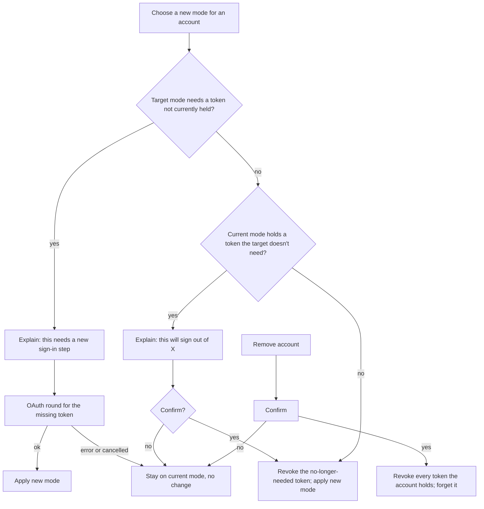

# FLW-22 — Change account mode / remove account   [Must]

**Trigger:** "Mode" or "Notifications" row, or "Remove account", from an account's detail view in
`SCR-30`; **or** the notifications master switch on `SCR-25` (on/off only — mode/removal stay
`SCR-30`-only); **or** the app treating OS-permission-denied as an off decision (`FLW-20`,
`FLW-16`).
**Screens:** `SCR-30` (account detail) → possibly an `SCR-01`-style authorization round → back to
`SCR-30`.

> Implements the token lifecycle table in [auth.md](../api-appendix/auth.md) as user-facing
> behaviour.

## Diagram

## Steps, branches & rules

1. **Changing mode** applies the token lifecycle rules in [auth.md](../api-appendix/auth.md)
   directly:
   - If the target mode needs a token the account doesn't currently hold, the app **explains
     this requires a new sign-in step** before launching the OAuth round for just that token —
     never re-authorizes a token that's already held and still valid.
   - If the current mode holds a token the target mode no longer needs, the app **explains what
     will be given up** (e.g. "This will sign you out of posting and reacting") and asks for
     confirmation before revoking it.
   - Some transitions need both in sequence (e.g. Read-only → Read-write + notifications: a new
     write authorization; the existing read token is kept as-is for the notification side, no
     further step needed for it).
   - A cancelled or failed authorization step leaves the account on its **current** mode,
     unchanged — mode changes are all-or-nothing, never left half-applied.
2. **Toggling notifications while Read-write** always needs a fresh read-token authorization,
   whether turning it on for the first time or re-enabling after previously turning it off — the
   read token is revoked whenever notifications go off, per [auth.md](../api-appendix/auth.md).
   Turning notifications off **deregisters the account from the notification service** (a real
   `DELETE`, not just letting the revoked token fail on the service's next poll); turning them back
   on **re-registers** with the newly-authorized read token — see
   [`../../ImplementationSpec/notification-service.md`](../../ImplementationSpec/notification-service.md).
3. **The `SCR-25` master switch runs this exact same on/off logic**, not a lighter variant of it —
   tapping it off asks for the same confirmation as `SCR-30`'s Notifications row before revoking;
   tapping it on runs the same OAuth-plus-OS-permission sequence as `FLW-20`. It's a second entry
   point into steps 1–2, not a separate mechanism.
4. **OS-permission-denied is not a distinct remembered state.** Whether notifications end up off
   because the user tapped the switch, or because the OS permission was refused or found missing on
   a launch check (`FLW-16`, `FLW-20`), the app runs the identical off-path above — same revoke,
   same deregister. Nothing about "the user's real preference was on" is kept; re-enabling always
   starts over as a fresh on-decision.
   **Turning notifications back on settles the OS permission first**, per `FLW-20` step 5 — and
   where it has already been refused, the app routes to system settings rather than running a
   read-token authorization it would immediately have to revoke. See [rules.md](../rules.md)
   (Notifications & unread counts).
5. **Remove account** → confirm → revoke every token the account currently holds (one or two) and
   forget it entirely — distinct from downgrading to Read-only, which keeps the account, just
   reduces what it can do. If it was active, `FLW-21`'s "switch to another account, or go
   anonymous" behaviour applies.
6. A **needs-reauth** account (`FLW-02`) re-authorizing its missing token uses this same flow's
   "needs a new sign-in step" branch, scoped to just the one missing token — any other,
   still-valid token it holds is untouched. This is also how a notification-service-reported stale
   read token gets fixed: scoped to that one token, the account's write access was never affected.

## Acceptance criteria
- [ ] Every mode change follows the token lifecycle table in `auth.md` exactly — no transition
      silently upgrades scope or silently retains a token the new mode doesn't need.
- [ ] Turning notifications off deregisters the account from the notification service; turning
      them back on re-registers with the newly-authorized read token.
- [ ] The `SCR-25` master switch produces identical behaviour to the `SCR-30` Notifications row —
      same confirmation, same revoke/re-auth sequence.
- [ ] OS-permission-denied (refused, or found missing on a launch check) is handled as an ordinary
      off-decision, indistinguishable from the user tapping the switch, with no memory of a prior
      "on" preference.
- [ ] The user sees, and confirms, any token revocation before it happens.
- [ ] A cancelled/failed authorization during a mode change leaves the account on its prior mode.
- [ ] Removing an account revokes all tokens it holds and forgets it, distinct from downgrading
      to Read-only.
- [ ] Re-authorizing a needs-reauth account only requests the missing token, leaving any other
      valid token untouched.
